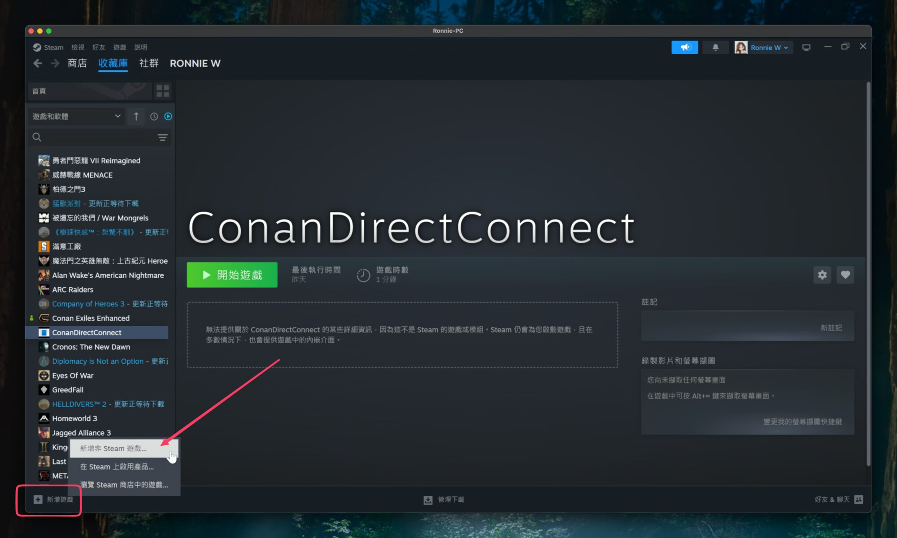
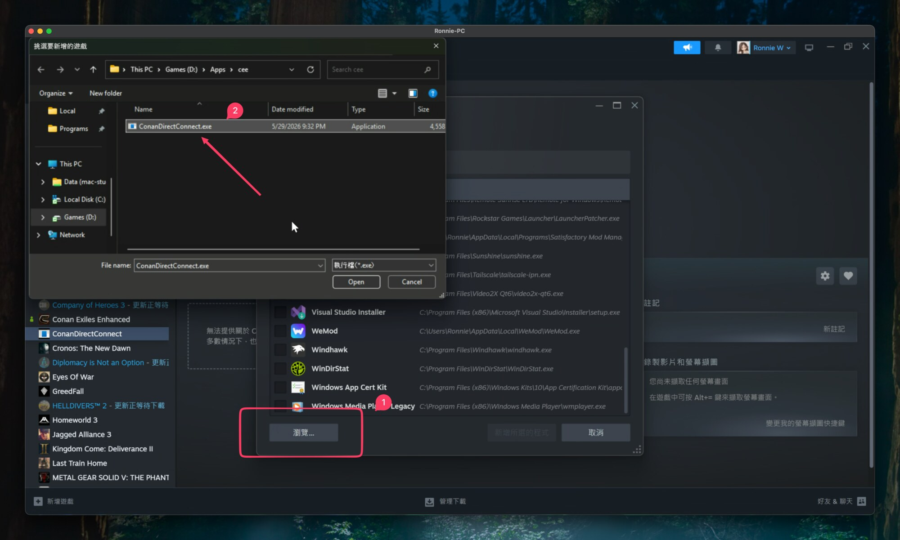
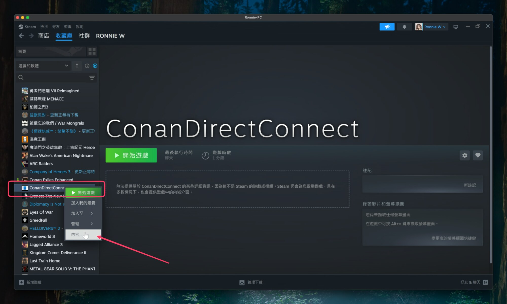
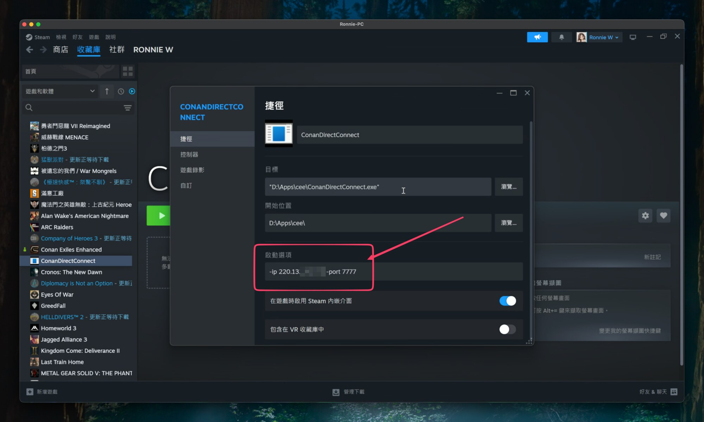

# ConanDirectConnect

ConanDirectConnect 是一個 Windows 小工具，用來從 Steam 啟動 Conan
Exiles，並自動進入指定伺服器。

它會先寫入 Conan Exiles 的 restart ticket，更新玩家端 `Game.ini`，再透過
Steam 的 `steam://run/440900` 啟動遊戲。這樣可以保留 Steam 和 BattlEye 的
正常啟動流程，同時讓遊戲讀取 restart ticket 自動連線。

## 下載

請到 GitHub Releases 下載最新版：

[ConanDirectConnect Releases](https://github.com/qoli/ConanDirectConnect/releases)

下載 `ConanDirectConnect-*-windows-amd64.zip`，解壓縮後會得到
`ConanDirectConnect.exe`。

Release 故意用 zip 包起來，而不是直接提供裸 `.exe`，這樣比較不容易被瀏覽器
或下載流程直接攔截。

## 快速使用

如果你只想直接執行，可以在 PowerShell 或命令提示字元裡使用：

```powershell
.\ConanDirectConnect.exe -ip 203.0.113.10 -port 7777
```

也可以使用網域：

```powershell
.\ConanDirectConnect.exe -domain conan.example.com -port 7777
```

`-ip` 需要填 IPv4 位址。`-domain` 會先解析成 IPv4，再寫入 Conan Exiles 的
連線狀態，因為遊戲的 direct connect 目標應該是數字形式的 `IP:port`。

## 建議用法：加入 Steam 捷徑

推薦把 `ConanDirectConnect.exe` 加進 Steam 收藏庫，之後玩家只要按 Steam 的
「開始遊戲」就能啟動並自動連線。

### 1. 新增非 Steam 遊戲

在 Steam 收藏庫左下角點「新增遊戲」，選擇「新增非 Steam 遊戲...」。



### 2. 選擇 ConanDirectConnect.exe

按「瀏覽...」，找到解壓縮後的 `ConanDirectConnect.exe`，選取後加入 Steam。



### 3. 開啟捷徑內容

在 Steam 收藏庫裡找到 `ConanDirectConnect`，右鍵選單選擇「內容...」。



### 4. 填入啟動選項

在「啟動選項」填入伺服器位址和 port。

```text
-ip 203.0.113.10 -port 7777
```

如果你使用網域，則改成：

```text
-domain conan.example.com -port 7777
```



完成後回到收藏庫，按 `ConanDirectConnect` 的「開始遊戲」即可。

## 常用參數

```powershell
.\ConanDirectConnect.exe -ip 203.0.113.10 -port 7777
.\ConanDirectConnect.exe -domain conan.example.com -port 7777
.\ConanDirectConnect.exe -ip 203.0.113.10 -game-dir "D:\SteamLibrary\steamapps\common\Conan Exiles"
.\ConanDirectConnect.exe -ip 203.0.113.10 -no-launch
```

`-no-launch` 只寫入 Conan Exiles 的連線狀態，不啟動 Steam。這適合用來檢查
`ModRestartData.json` 和 `Game.ini` 是否正確。

## Mod 管理邊界

這個工具不管理 mod。

它不查詢 A2S rules，不接收 Workshop ID 清單，不產生
`ConanSandbox/servermodlist.txt`，也不讀取或修改
`ConanSandbox/Mods/modlist.txt`。Mod 訂閱、下載、排序和 mismatch 處理都交給
官方 launcher 或遊戲本身。

它唯一寫入的 mod 相關欄位是 restart ticket 裡的 `ModList`，內容會指向已存在
的 `ConanSandbox/servermodlist.txt`。如果這個文件不存在，工具會停止並報錯，
不會猜測 mod 清單。

## 這個工具會改什麼

啟動前，ConanDirectConnect 會：

1. 尋找 Conan Exiles 的 Steam 安裝位置。
2. 備份 `ConanSandbox\Saved\Config\Windows\Game.ini`。
3. 設定 `SavedServers.LastConnected` 和 `SavedServers.LastPassword`。
4. 啟用 `Settings.ModMismatch.AutoSubscribe`、`AutoConnect` 和
   `bAutoRestart`。
5. 寫入 `ConanSandbox\Saved\ModRestartData.json`。
6. 用 `steam://run/440900` 啟動 Steam 裡的 Conan Exiles。

每次執行都會在 `ConanDirectConnect.exe` 旁邊追加
`ConanDirectConnect.log`，方便檢查收到的參數、解析後的伺服器位址、遊戲路徑、
restart ticket 寫入狀態和啟動命令。

## 從原始碼建置

需要：

- Go 1.22 或更新版本
- 在 macOS 或 Linux 建立 release zip 時，需要 `zip` 和 `unzip`

建置 Windows 執行檔：

```bash
GOOS=windows GOARCH=amd64 go build -o ConanDirectConnect.exe .
```

建置 release zip：

```bash
VERSION=v0.1.0 ./scripts/build-release.sh
```

zip 會輸出到 `dist/`。

## 備註

預設啟動模式是 `steam-run`。`continue-session` 和 `launcher-connect` 保留作為
診斷模式，但已驗證的正常路徑是 Steam-run。
